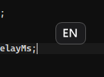

# Input Language Popup

[](https://github.com/DIMOSUS/InputLanguagePopup/actions/workflows/ci.yml)
[](https://github.com/DIMOSUS/InputLanguagePopup/releases/latest)

A tiny background (tray) application for Windows that shows the **currently active
keyboard layout** next to the text caret whenever you switch layouts from the
keyboard — with the toggle hotkey configured in Windows (**`Ctrl+Shift`** or
**`Alt+Shift`**, read live from the system settings so no restart is needed after
changing it) as well as the hardwired **`Win+Space`** switcher.

<p align="center">
  
</p>

* It **does not** switch the language itself.
* It **does not** reserve, intercept, or block any of these combinations — Windows
  keeps handling the switch normally.
* It shows the layout that is *actually* active afterwards. If Windows decided not
  to switch, it shows the unchanged layout (it never assumes a change happened).
* When **CapsLock** is on, the code is suffixed with `CAPS` (e.g. `EN CAPS`).

The indicator appears:

1. next to the **text caret** in the active application, or
2. next to the **mouse cursor** when the caret cannot be located.

The caret is located with a cascade of strategies for broad app coverage: the
system caret (`GetGUIThreadInfo`) → MSAA (`oleacc`) → UI Automation
(`TextPattern2`) → the mouse cursor.

---

## Requirements

* **Windows 11 x64.** Windows 10 22H2 x64 works on a best-effort basis (the binary is
  fully self-contained), but note that regular Windows 10 Home/Pro is no longer in
  Microsoft's supported-OS matrix for .NET 10 — only certain LTSC/Enterprise editions
  are — so it is tested but not officially supported.
* To build: **.NET 10 SDK** (`dotnet --version` → `10.x`). To *publish*, also Visual
  Studio or the Build Tools with the **Desktop development with C++** workload —
  Native AOT needs the MSVC linker.
* To run the published binary: **nothing** — it is a ~3 MB native executable with no
  .NET runtime dependency.

The app runs entirely as a normal user; **administrator rights are not required**.

---

## Build

```powershell
dotnet build InputLanguagePopup.sln -c Release
```

## Run (from source)

```powershell
dotnet run --project src\InputLanguagePopup\InputLanguagePopup.csproj -c Release
```

A tray icon (`AЯ`) appears. Right-click it for the menu:

| Item                | Action                                                    |
| ------------------- | --------------------------------------------------------- |
| **Enabled**         | Turn the indicator on/off (hook stays installed either way)|
| **Show test popup** | Show a test popup next to the mouse cursor                |
| **Start with Windows** | Add/remove an autostart entry (per-user, no admin)     |
| **Exit**            | Cleanly remove the hook and quit                          |

## Run the tests

```powershell
dotnet test InputLanguagePopup.sln -c Release
```

The unit tests cover the gesture-recognition state machine (Ctrl+Shift / Alt+Shift /
Win+Space, cancellation, staleness), the system-hotkey interpretation, popup
positioning (DPI, multi-monitor, negative coordinates), and settings normalization.

## Publish (Native AOT, x64)

```powershell
.\publish.ps1
```

or directly:

```powershell
dotnet publish src\InputLanguagePopup\InputLanguagePopup.csproj -c Release -r win-x64
```

(`PublishAot` is set in the project file.) Verify a build with:

```powershell
.\publish\InputLanguagePopup.exe --selftest
```

which exercises settings, layout detection, the MSAA/UI-Automation caret chain, the
DPI probe and the layered popup, then writes
`%LocalAppData%\InputLanguagePopup\selftest.log`.

The result is a single native `InputLanguagePopup.exe` (**~3 MB**) in `.\publish\` that
runs on any Windows 10/11 x64 machine without a pre-installed .NET runtime.

> The UI is hand-rolled Win32 (window class, message loop, `Shell_NotifyIcon` tray,
> `TrackPopupMenu`, `SetTimer`) rather than WinForms, because WinForms is not
> AOT/trim-compatible. Rendering still uses `System.Drawing`, and the COM calls
> (UI Automation, MSAA) go straight through the object vtables with function
> pointers, since Native AOT has no built-in COM interop.

---

## Continuous integration & releases

Two GitHub Actions workflows (`.github/workflows/`):

* **CI** (`ci.yml`) — builds and runs the unit tests on `windows-latest` for every
  push and pull request to `main`.
* **Release** (`release.yml`) — triggered by pushing a `v*` tag. It runs the tests,
  publishes the single-file self-contained x64 executable (with the version stamped
  from the tag), and attaches it to an automatically-created GitHub Release with
  generated release notes.

To cut a release:

```powershell
git tag v1.0.0
git push origin v1.0.0
```

A tag containing a hyphen (e.g. `v1.1.0-beta`) is published as a pre-release. The
downloadable asset is named `InputLanguagePopup-<tag>-win-x64.exe`.

---

## Settings

Stored as JSON at:

```
%LocalAppData%\InputLanguagePopup\settings.json
```

If the file is missing or corrupt, defaults are used (and a fresh file is written).
There is no settings UI in this version — edit the JSON by hand and restart the app.

```json
{
  "enabled": true,
  "popupDurationMs": 850,
  "firstLayoutCheckDelayMs": 50,
  "secondLayoutCheckDelayMs": 140,
  "caretOffsetX": 8,
  "caretOffsetY": 8,
  "cursorOffsetX": 16,
  "cursorOffsetY": 20,
  "useUiAutomation": true,
  "handleWinSpace": true,
  "startWithWindows": false
}
```

| Field                     | Meaning                                                   |
| ------------------------- | --------------------------------------------------------- |
| `enabled`                 | Master on/off (mirrors the tray **Enabled** item)         |
| `popupDurationMs`         | How long the popup stays fully visible before fading      |
| `firstLayoutCheckDelayMs` | Delay after the chord before the first layout read        |
| `secondLayoutCheckDelayMs`| Delay for the second read (catches slow switches)         |
| `caretOffsetX/Y`          | Offset (logical px) of the popup from the caret           |
| `cursorOffsetX/Y`         | Offset (logical px) of the popup from the mouse cursor    |
| `useUiAutomation`         | Enable the UI Automation caret fallback                   |
| `handleWinSpace`          | Also show the indicator after `Win+Space`                 |
| `startWithWindows`        | Autostart entry (mirrors the tray item)                   |

Values are clamped to sane ranges on load. If the file cannot be parsed it is moved
aside to `settings.corrupt.<timestamp>.json` and a fresh default file is written.

## Logs

Stored at:

```
%LocalAppData%\InputLanguagePopup\logs\app.log
```

Rotated at ~1 MB, keeping at most 5 files (`app.log`, `app.log.1` … `app.log.4`).

Logged: startup/shutdown, hook install/remove, Win32/UI-Automation errors, cases where
the layout could not be resolved, and unhandled exceptions. **Individual keystrokes are
never logged** — this is not a keylogger.

---

## Known limitations

* Does not run on the **Secure Desktop** (UAC prompt) or the **Windows lock/login
  screen** — a normal-privilege hook is inactive there.
* The **text caret cannot be located in every application**. The cascade (system
  caret → MSAA → UI Automation) covers most apps — including Chromium/Electron and
  Qt/Telegram, which are special-cased — but apps that render text themselves and
  expose no caret or accessibility provider (some games, terminals with custom
  rendering, certain custom controls) fall back to the **mouse cursor** position.
  Unlike some tools, this app never injects code into other processes to read the
  caret, so a handful of hardened apps will always use the cursor fallback.
* Layouts are shown as a two-letter code. `RU`, `EN`, `LT` are handled explicitly;
  everything else uses the two-letter ISO code from `CultureInfo`. Distinguishing
  several layouts of the same language (e.g. *English US* vs *English UK*) is possible
  in the design but not surfaced in this version.
* The rare grave-accent (`` ` ``) layout hotkey (registry code 4, used for Thai and a
  few other languages) is not supported. Per-layout direct hotkeys (e.g. a
  `Ctrl+Shift+0` assignment under `HKCU\Control Panel\Input Method\Hot Keys`) are
  intentionally ignored — a chord with an extra key never triggers the indicator.
* **Synthetic (injected) key events are ignored.** A layout switch triggered by
  AutoHotkey, key-remapping tools, or some accessibility software will not show the
  indicator, even if Windows actually changed the layout — the hook filters
  `LLKHF_INJECTED` so that programmatic input cannot trigger a popup.
* One instance runs **per user session** (guarded by a session-local mutex), so Fast
  User Switching / RDP sessions each get their own indicator.

---

## Documentation

* **[ARCHITECTURE.md](ARCHITECTURE.md)** — component overview, threading model, the
  full list of Win32 / COM APIs used, and the acceptance-criteria verification report.
